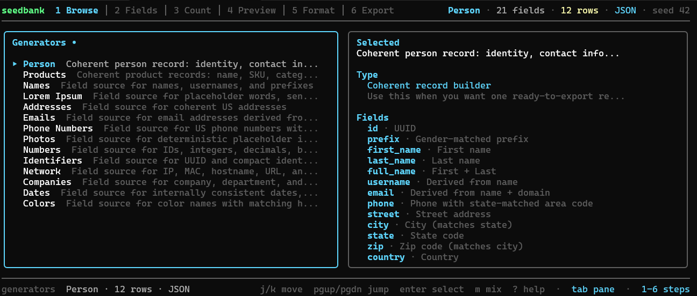
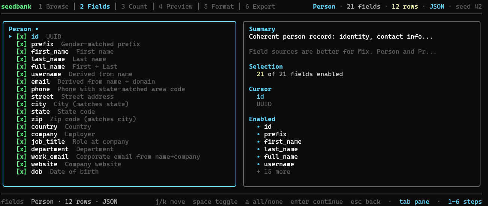
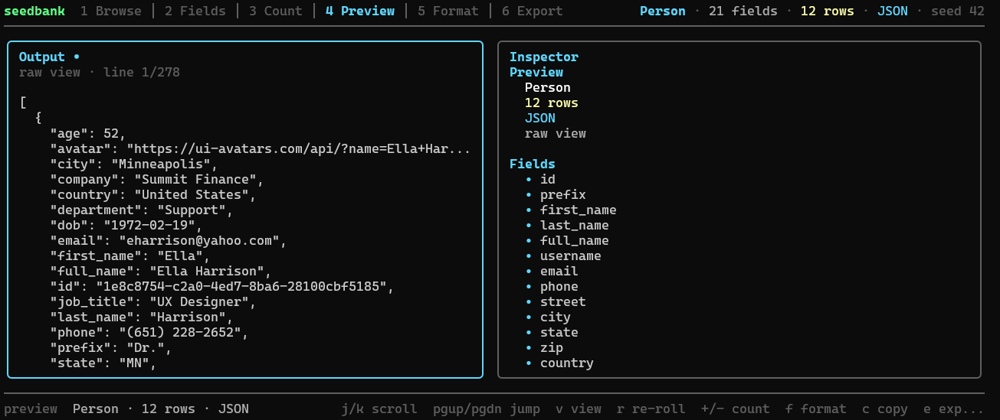

# seedbank

Terminal fake-data generator for fixtures, demos, and seed scripts. `seedbank` lets you preview realistic records quickly and export them in the formats you actually need for tests, demos, and seed data.



**Live demo:** [froesch.dev](https://froesch.dev)

## Install

Supported platforms: Linux and macOS.

Windows release binaries and installer entrypoints are shipped, but native Windows support is unverified.

Recommended:

```bash
curl -fsSL https://raw.githubusercontent.com/LFroesch/seedbank/main/install.sh | bash
```

Windows:

```powershell
./install.ps1
```

```bat
install.cmd
```

Other options:

```bash
go install github.com/LFroesch/seedbank@latest
make install
```

Run:

```bash
seedbank
seedbank --list
seedbank --gen person --count 25 --fmt json --out fixtures/users.json
```

## Media





## Output Formats

- JSON
- JSONL
- CSV
- Markdown table
- SQL `INSERT`

## Generators

Broadly, `seedbank` has two kinds of generators:

- coherent record builders like `person` and `products`
- field sources like names, addresses, emails, dates, identifiers, network values, and colors

The TUI also has a custom mix mode for composing fields from multiple field-source generators into one record shape.

The built-in data aims for internal consistency, especially around names, email patterns, address fields, phone area codes, and date-derived values.

## TUI Flow

1. Pick a generator
2. Toggle fields
3. Set record count
4. Preview output
5. Export or copy it

Config is stored at `~/.config/seedbank/config.json`.

## CLI

Use `--gen` to skip the TUI:

```bash
seedbank --list
seedbank --gen person --count 10 --fmt json
seedbank --gen identifiers --fields uuid,short_id --fmt csv
seedbank --gen network --count 20 --fmt jsonl
seedbank --gen products --count 50 --fmt sql --table products --out db/seed/products.sql
seedbank --gen person --count 3 --fmt json --seed 42
```

Useful flags:

- `--fields`
- `--count`
- `--fmt`
- `--table`
- `--seed`
- `--out`
- `--schema`

Relative `--out` paths are written relative to the directory where you launch `seedbank`.

## Schema Mode

`--schema <file.sql>` is a heuristic single-table mode that reads a `CREATE TABLE` statement and tries to map columns to sensible generators based on type and name.

Example:

```bash
seedbank --schema db/schema/users.sql --count 100 --fmt json
seedbank --schema db/schema/orders.sql --count 500 --fmt sql --out db/seed/orders.sql
```

## Controls

| Key | Action |
|-----|--------|
| `j/k` | Move |
| `enter` | Select or confirm |
| `space` | Toggle field |
| `a` | Toggle all or none |
| `m` | Open custom mix |
| `1-6` | Jump between workflow steps |
| `+/-` | Change record count |
| `f` | Change output format |
| `r` | Re-roll data |
| `e` | Export |
| `c` | Copy |
| `?` | Help |
| `q` | Back or quit |

## License

[AGPL-3.0](LICENSE)
